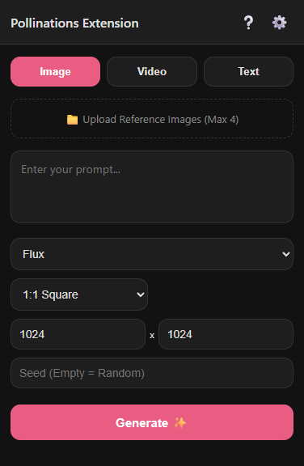
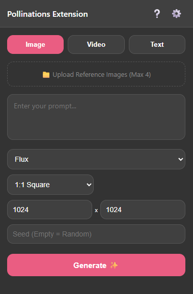
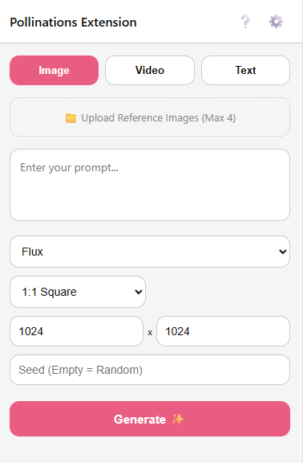
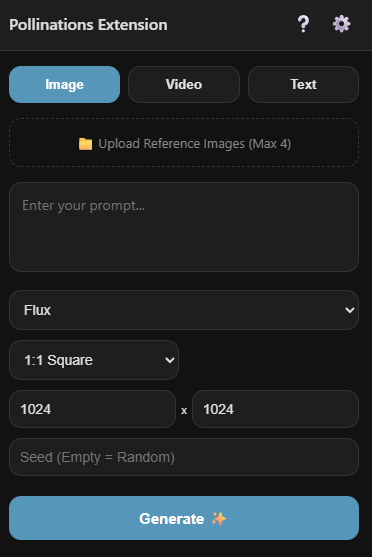
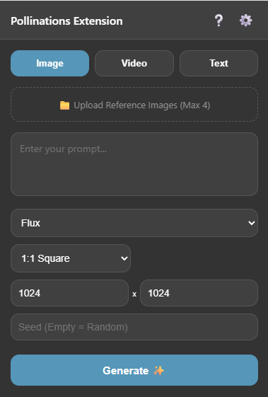
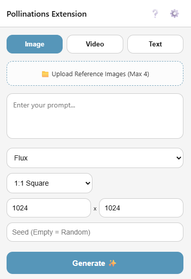

# 🌸 Pollinations Bridge (Browser Extension)

[![Built with Pollinations](https://img.shields.io/badge/Built%20with-Pollinations-8a2be2?style=for-the-badge&labelColor=6a0dad&logo=data:image/png;base64,iVBORw0KGgoAAAANSUhEUgAAADIAAAAyCAMAAAAp4XiDAAAC61BMVEUAAAAdHR0AAAD+/v7X19cAAAD8/Pz+/v7+/v4AAAD+/v7+/v7+/v75+fn5+fn+/v7+/v7Jycn+/v7+/v7+/v77+/v+/v77+/v8/PwFBQXp6enR0dHOzs719fXW1tbu7u7+/v7+/v7+/v79/f3+/v7+/v78/Pz6+vr19fVzc3P9/f3R0dH+/v7o6OicnJwEBAQMDAzh4eHx8fH+/v7n5+f+/v7z8/PR0dH39/fX19fFxcWvr6/+/v7IyMjv7+/y8vKOjo5/f39hYWFoaGjx8fGJiYlCQkL+/v69vb13d3dAQEAxMTGoqKj9/f3X19cDAwP4+PgCAgK2traTk5MKCgr29vacnJwAAADx8fH19fXc3Nz9/f3FxcXy8vLAwMDJycnl5eXPz8/6+vrf39+5ubnx8fHt7e3+/v61tbX39/fAwMDR0dHe3t7BwcHQ0NCysrLW1tb09PT+/v6bm5vv7+/b29uysrKWlpaLi4vh4eGDg4PExMT+/v6rq6vn5+d8fHxycnL+/v76+vq8vLyvr6+JiYlnZ2fj4+Nubm7+/v7+/v7p6enX19epqamBgYG8vLydnZ3+/v7U1NRYWFiqqqqbm5svLy+fn5+RkZEpKSkKCgrz8/OsrKwcHByVlZVUVFT5+flKSkr19fXDw8Py8vLJycn4+Pj8/PywsLDg4ODb29vFxcXp6ene3t7r6+v29vbj4+PZ2dnS0tL09PTGxsbo6Ojg4OCvr6/Gxsbu7u7a2trn5+fExMSjo6O8vLz19fWNjY3e3t6srKzz8/PBwcHY2Nj19fW+vr6Pj4+goKCTk5O7u7u0tLTT09ORkZHe3t7CwsKDg4NsbGyurq5nZ2fOzs7GxsZlZWVcXFz+/v5UVFRUVFS8vLx5eXnY2NhYWFipqanX19dVVVXGxsampqZUVFRycnI6Ojr+/v4AAAD////8/Pz6+vr29vbt7e3q6urS0tLl5eX+/v7w8PD09PTy8vLc3Nzn5+fU1NTdRJUhAAAA6nRSTlMABhDJ3A72zYsJ8uWhJxX66+bc0b2Qd2U+KQn++/jw7sXBubCsppWJh2hROjYwJyEa/v38+O/t7Onp5t3VyMGckHRyYF1ZVkxLSEJAOi4mJSIgHBoTEhIMBvz6+Pb09PLw5N/e3Nra19bV1NLPxsXFxMO1sq6urqmloJuamZWUi4mAfnx1dHNycW9paWdmY2FgWVVVVEpIQjQzMSsrKCMfFhQN+/f38O/v7u3s6+fm5eLh3t3d1dPR0M7Kx8HAu7q4s7Oxraulo6OflouFgoJ/fn59e3t0bWlmXlpYVFBISEJAPDY0KignFxUg80hDAAADxUlEQVRIx92VVZhSQRiGf0BAQkEM0G3XddPu7u7u7u7u7u7u7u7u7u7W7xyEXfPSGc6RVRdW9lLfi3k+5uFl/pn5D4f+OTIsTbKSKahWEo0RwCFdkowHuDAZfZJi2NBeRwNwxXfjvblZNSJFUTz2WUnjqEiMWvmbvPXRmIDhUiiPrpQYxUJUKpU2JG1UCn0hBUn0wWxbeEYVI6R79oRKO3syRuAXmIRZJFNLo8Fn/xZsPsCRLaGSuiAfFe+m50WH+dLUSiM+DVtQm8dwh4dVtKnkYNiZM8jlZAj+3Mn+UppM/rFGQkUlKylwtbKwfQXvGZSMRomfiqfCZKUKitNdDCKagf4UgzGJKJaC8Qr1+LKMLGuyky1eqeF9laoYQvQCo1Pw2ymHSGk2reMD/UadqMxpGtktGZPb2KYbdSFS5O8eEZueKJ1QiWjRxEyp9dAarVXdwvLkZnwtGPS5YwE7LJOoZw4lu9iPTdrz1vGnmDQQ/Pevzd0pB4RTlWUlC5rNykYjxQX05tYWFB2AMkSlgYtEKXN1C4fzfEUlGfZR7QqdMZVkjq1eRvQUl1jUjRKBIqwYEz/eCAhxx1l9FINh/Oo26ci9TFdefnM1MSpvhTiH6uhxj1KuQ8OSxDE6lhCNRMlfWhLTiMbhMnGWtkUrxUo97lNm+JWVr7cXG3IV0sUrdbcFZCVFmwaLiZM1CNdJj7lV8FUySPV1CdVXxVaiX4gW29SlV8KumsR53iCgvEGIDBbHk4swjGW14Tb9xkx0qMqGltHEmYy8GnEz+kl3kIn1Q4YwDKQ/mCZqSlN0XqSt7rpsMFrzlHJino8lKKYwMxIwrxWCbYuH5tT0iJhQ2moC4s6Vs6YLNX85+iyFEX5jyQPqUc2RJ6wtXMQBgpQ2nG2H2F4LyTPq6aeTbSyQL1WXvkNMAPoOOty5QGBgvm430lNi1FMrFawd7blz5yzKf0XJPvpAyrTo3zvfaBzIQj5Qxzq4Z7BJ6Eeh3+mOiMKhg0f8xZuRB9+cjY88Ym3vVFOFk42d34ChiZVmRetS1ZRqHjM6lXxnympPiuCEd6N6ro5KKUmKzBlM8SLIj61MqJ+7bVdoinh9PYZ8yipH3rfx2ZLjtZeyCguiprx8zFpBCJjtzqLdc2lhjlJzzDuk08n8qdQ8Q6C0m+Ti+AotG9b2pBh2Exljpa+lbsE1qbG0fmyXcXM9Kb0xKernqyUc46LM69WuHIFr5QxNs3tSau4BmlaU815gVVn5KT8I+D/00pFlIt1/vLoyke72VUy9mZ7+T34APOliYxzwd1sAAAAASUVORK5CYII=)](https://pollinations.ai/)

> **A unified "Bring Your Own Pollen" (BYOP) workspace for Pollinations.ai.**  
> Generate Image, Video, and Text directly from your browser sidebar using your own API Key.

<!-- Badges -->
[![Chrome](https://img.shields.io/badge/Chrome-Live-green?logo=data:image/webp;base64,UklGRjYLAABXRUJQVlA4TCkLAAAvO8AOEAmGbdtGDkKy7/VdRP+D7Ftbt29DDbQ+CrbPqb+tgdm0SZq0bEsWTCPbdrJE+RVJoui/rD+onHE0wTaSpEZtoSLAJP/QeK2FxSaybSdLzkHC9wD4t8CggD53dEz/E+ohkUIKHTvQeUFGjKqBsHnXYczCnx0lLgEw9jz8E9CdCYBp9YUFJaUYJNELXGm+EqkkEAKMwAJ+vsvf36IIENmx/0+RJOcfNdU7/JaZmZl3h5YtEDMzM3pyWbLoACxZzMzMzEw9PTzNFUZlVWfXCb530IsXT/Q7wdJAvqX2xhNLeZO4RL4USweQy2ySyXgClqcjaB3Jtm2btjPmOffZ9ntJSknVdj7BtlW0bdu2bdu2bfu+sxed29aO7dVa9xvbtm3bttnZtv5B0pmdWSWlbZvHts/7XJJoWzv25iT50fxWbNu27aSY2u3ctma2bdtuf9V2G9vOBBhYkO9BbztIZ/4iwkJEOWe0gacDtaHKQO0AgxbD1oZsacH3Buidlwwz/cz8xOznXfTsUS9ba/3/gpWOGOdkuoGVBWAS2r9qiBPgEBMYDM1/2fKWeZw49mJzTW8c9aBdgvfTPAf5BsLvlEzwfINsM3YZbO2j0N55V9vHTd5RNiDBe843KP5OSb7OFJooa7hs08LLrTMm5xAbqmrBeA/FBbmX38FBkpGbsehie90kTOO/pK+ZgQeYlOI3jkj9cF6L3i0XmEWxgWOavMLQzouMyzeYaJXLQNRHsTecA73Abxz6vPf6l5IcDvqhbVNeM4ikN79TGOrHzMJn5bxtmMjhr6tJmnDhf/QMv+jjr/QnZn/Z1d3lDavWjxJHDeLpoe80jCvjWX+VP11fDXb15geNt/yfniocsfUpWR9mdXPYgwYlRkyjxzBS5VOz3p7rdMiTOirv3EbPOVHTjPovuJOFC242cOq97zjzSIeHlB0Xf9CRct7kadC/uSqYTtLgnuOst+2u1LPbmNKqBv8zqp9aV/Gsvp/z9f06IxnRdxEGAiMg4oFIJBI9EonAk/4XjM/ycvFpoZaOTaW+roKXEC5w0LbIskd39saEb0xxLZ1H9HXz65n1erHORhkooigAhAohMMWijIfsGhppRn6D5HKyWj2b0Pby4x2UD9wYtXQ/rK+qX0bXP4N6Ey+EQxDthZCDwif/LxjTZrDo197gAGpEzaFofXcGg8eSb9xM2ANj/+FN5+G1x2HgNSz7IGycKZsXwL71gj2rQDNKgDex9MEfAFEihCiQU8wFHrihv7rlKPROzMBJ+WXU/nN3u0rNr2H0HzxrdfC0pRmDP4XsmUlyYueMeW2CvmiBWV4toRCZbUIei59lqMFFF6oyQxSptnJlknZShY9dmCF4B3YCH3omz98kA6+BbjcrgGvPHcW2pQFWu7ed5wshSgBROhSNhAuWgznGUlXBCMvTw+2GnBjp9GyX5MCyj7LyS4IJTo+Tq88YxT61AYORAbuocAAgRIkAOTmWh20dKfOQUYVQVTO8gsGH4dMO71YKWkz6Dz9i4n+82YaRwDDf1Q7xKVCFyCyR5DHrUYZkzP8v3ExBqCrMxDuYr/DsE11Zd7fcZ9iySOakQg5sXghblgJ4Y7Dug0cFQggBkqFwZnHRMB9EFBAizpS7AIdTx/Aq41t3ajg6DJ4VBANAHjxrRQD7sDrUYECURYYowSzmmIwkRA9A8AR7HiNu49f+a9uCRoZN3hfXGjAGPM0F5PrUBTAWBvoob9NHOaMkVABClCb3ecI7Jgg1GFif2Sf/t+1ktvbCG4FBST6D3+HNZwPY2vp00YYK0W7wuOVCAyQgpU1fmLDrGczAfLfcFl4fBOT8umMAm6m7bSkyhRCG7x2oCBEgRk4b8u8o5xyG3dXfHvqBvPqfBzCbhnYqSyEEBcKw2kBVA1UEL0h9//Q/ZnH+CcylmhyWI3ktfw/QR2mFEEWbUIFBTw1VhJTMgviRQ1f+E7DRL9sByrx+A1ESAtqQEd0GrRWQAvEjHwmNQN1pg/4yslxftcNcP5HXxlkAo/q1nQwVot1BtTdaIwQiKRCTQf/j+mJ51zIrqmELk7w2LxJYxYvasiTTkEIIw3dGtJCIpEBMBJanh3HHXtvrDGBfQV771QVYzIU6qSwRAgph+Njj1xBJEBOBGt7VoY0B9nQwU4l8ZiXL7pUD6Nc5hSGIDCFwYq8DI4lAgpAiIbUi/b40/ftGmpITXZDPiV2DZqQwqu/qR/VTpCREQYbMmOMUBgIRAjUED0Se9/yIAeYBm0ny2LwI5rXKgDey8a1DQZEhStoNElcUFzE7GIyJQA0hRaje++Bp3Orgl//0Idd1rZkBTGx6HFxrcUYzShgKvvk3oEsxUlnQLkr0ueGIgrKb3jre6eEOgRpCilARvUL1yPtTqzewNXA115rpwER+eJWZABte+m7uV0OF2hECkMH1RfaDCLNYCxBIkZCIXLAi/GPMc14fvgH7ADez1myOdPepbwMv3rL30nju6xQhBCVCCDMmLrLvC5hmxc55YqAmpJqQMAIqiB6Gjh+08Nn+zUYmw9i/4FmCpyKDQIefn9gD5rWTL8ErNlx//IG0HU7OR+Akl0hC4AwQRsLhjudWqaGBa0b/1eThaqjqSCJSQUyBP+zTYPDlBSOXl/4axgRvNnit5N9LJWxisHlRYt/6skc1+C8YjDxj8Kw7L9x6TLBx3c+jhJzgkjahT/K3Uf23G8AHrvDESMQbVJEEMQWoCXNzK+nPWL3NYU5ORSe6X/3h17+PaDTg3/Ln30ftOlUHZf6ddiHDiqdXrRLTdv04DU7eDBWRQHYdoDZo27lu15eL8g+FzYwobdvF6o+/1T2t38w3bzv8MNZAuXHd7x7MLPWLm0NokwohwOEyMscDlqcYK4gpQE0gxUAyGJgRUVK/R2LHrl2S2tpuFlvTfqZfSs5g8FtH/93Pa9526H7jW/bekQ5+/i3aTAHOs27niaUjpbJECFQI8exK1ZKzbhCXnpo4mioDYgpQE0iRkIjrvAcQLwDqdZC26f3q27T4vFySSkkIQGYcpmMzutgsM/7HGqgJpEhIRCqIFwDeC9ZBitNi8h+36fwxQULIAWWbkIOaJmg7XVv/tDbEjBToGEiRkIhcAPECoF63YZfpZQedp6UjUSqz+CSAjKicf+Zzx07QslQYvII1dfDAmtosSBASUAEJSIFfv3tswQ5JUCCEI1EmyTCLrh/GRqsWONTBA2vWnJW8IIYEsQLqAClCGnpo+PALq6c0hRCA5EiUjgLuTzME3bEkF7EHuzVrzvJAWhMTxAqoA6QYSBghec+U3FdHIkkZJZJkYDdCZTETbcX+IzNCGDzwkXhWIjMGIAYghoHderf+pt4pR8KRI4nMUlOGIzMpKWHiK1Po8lC95qzaAx+JFZCAFCAR8MU49W/ULGnKkVAhhCgdNjfI9ZLnqux/+8zinwc+EmugDpAiJM4i8e6pWDsSU5IEZBjpy3t52U2+d+HCYMvyl434X3uAGIAYgAgw9iVCVlz0oyOR0pSmECowqHNQeQUxRO6jiqceruABoA6QYiARDSzfMSZr1JQciZTUhpFONX11x4de2TOJt356odXEfu9ivkGRB4sY8ABnkeCsZKJj79knAoUQBWtk8KTF/4vmhQrdY7Lvo75xDd+5ZlHoQUQMCc5KsFUzTBtlqS2SotC3jLjijbXHRfiSXryveqjH/IIV3mXjzMz0QkAMCRqR/Nx1uAmiIBkMerhrxInxUJybjy307APcSMlq/9ewBka3MMoUXgZqI9TeUO82xppGpA0mW8yixeN3E4aGQz8eKmk+Ttt6DMgXAA==)](https://chrome.google.com/webstore/detail/bllpfpbfokmiadkpkkaichhbaplcphdb)
[![Edge](https://img.shields.io/badge/Edge-Live-green?logo=data:image/png;base64,iVBORw0KGgoAAAANSUhEUgAAADIAAAAyCAMAAAAp4XiDAAAC9FBMVEUAAAAXgKEsxcQNVqEZfMA1yF8MTZBF1ZRM2W4MSooCfNcNTI8/0HEDetE/zHwBe9dF0H0Fd8wDfdcCftoNTZIOTI8NTZAxwuwCfdcMS40wxuQ6zFgNUpgxzOENTZIBe9cOTZE6zW0Cftk0xPAMU5wvxOUMarBR3XIMUpkLhMovxdkvw9MvyLIzxvAFdsc4zlwTkdksxcovyN9R3G8Rhcgxx5MsxcE6zllN3IRa43I6zmAxybM5ymstx9wvybs6zV9E03wCfNc2y1QSfrgJQHgsvZ8xxIlR4YdS4YIOgMBL3osyyIEHbb0ckKkBedMRcKwXkb47058ksMkuwuEPSYkOTI8MYalA1ZQ4zVgCe9QCedIVld8SfbkKMmkDftcBetUNVZ4NU5sGgdkNUpksw9g0wu8uwt0rw9MOUJURkN0JhdkNUZcMidsNTZENT5MOjNwvwuFU33Mxw+cNTI4MS4tL2YoyweoUleADgd4rw8sKRoJY4ngrw9Ytxb9V4Hxh6HEsxMg80KNA0p1D1JdH1o80x24Hgtkrw84xx7kQc6wKSIVP24Q0xvABhukBhOYKh9sTic0MW6dS3oAvw+Myya0RbqENY5hP23lc5nU40/8Bfdo0yrQvxrM5zawJY6EOZ5s1yYEzx3VD0mY1yGY601s4zFs2yPUQkd8qsdowyL0Sfrs2zbETea87z6g2zKQxx6M8z5syx5g/0JI1yo0xxohD04ZL2IBH1nw7zXRa5HNL2HNG1G47zWcnqNAJf84Pg8sNfcQIaa86z4w+0IBk+H8yx3sJQnswyucSl+YKi+EOiNUUjdIThMMHc8EMeb4NdrcUdKUIV5tB0nlD03RB0G011foy0e8Wn+4uy94txdwsyNcEe9Iv0ssfnsYw0sISgL0GarkTe7UHYqw3y5VV645N24dj73VM4m8v0ucvu+Msx84tysglrLUcka893a0Zha0z0ptL55o21IQJPXQ413BD4WMgksEgl7oejrY4235S6nZJ52phTk2TAAAAXnRSTlMABv79C/4o/v7IsZoyGxGaI/336uK7q596W1hEQSQb+/XRzr+wrqqDaEc3HPLv6t3a2NPHwr+4uLevpJqagmlcTjDu5ubl5OLb1NTTz8/NzLGjhYOAfntuaFlWUlFLOj6IdQAABQBJREFUSMeF1HVcU1EUB/A3RwooSggidnd3d3fHZHso07mBbOicioQBE1CUTUVERKVESRtQQAkFBemWUOxu//Hc+/bGkyH+/ts+5/s55557N0Iz1u0n9Bji4tJi75CR4yb2bUX8L9YThpa8eFFcandol8vr8vLyyv4jJ/ZrDvTt4VCYXmJra7vHzg4QdNobXlnZf5zhv0C/dumFxzdDbBGijUfApXeuS4ybFO0HFDged3BwQIhpAvyuuL7TXaUJWO1OhexwdKQQ04SfBhLt/nF040VodTu1aQdEwwA5c9nNzX3/x7nGGgJCGzQbTTwQcdfd71Q3i2lYWGADszHbYOIKxMnpcN1sxmztkGC2YZJLiOx3enb4WN3ohl3RwguiSS67usFch485O9/rRd/HgBAoDwnxehkWlpgY9vJ4ejpF7IDsRcRdF5o4O+8+edKYHguAV9i3SMVZFEXOj8TNxSXU8V0QcUPkmPPu3SfvjaFeSQgMlBipVAYqPFFyFGeVOd/3FEMTIOH49GguaLJv33P8dnoUeIVFKgM9Hz+OiKiqqoqIqI70VCgVFaV4x40IbmPtWJh4FsCju3fuHMXJyoqoBvS29BVcvkejLvtg0csKKgKTEXjwYAuVhw+PZkVE5ijfv4In5uF3mUGgzWSCGBoWmIyAPRSHhu7EwSpS+fY1fpTR0boUQQb2bL3HM/lR0oNt9vZgIJgUFQ0ePnxateJNuAcmsSpy8+bN58OI9hXJ2UlbtwFRmdCdGUWD12nBu1u/6H1AQEDUlehYINeunaDMdmLpXRBHtkFok7GzJ0v19Hq+8fOLiqqNjb16FciJ7TjE4jZJW7cyTcZRfSywWXApKiqmNjYFE5Uh5pTxDqoNJONu2gZCnT5+UTExtSlArl+/ThE9YiCPxzShd9KmsxoIa8aVmJi4uJTUVCC3bt3S09s+jGjLY5pQe7lMn2BkxAcQcUGpqU+e5GHyqxcQpgkN/CxuROLj44OCkMi7ffu2nl69IWHC41AGocykNJnQlCFYM+OQCLpx40ZePpDg+i4E0VXKaTCZgZ8lws4dG8jklPig+/fvnwOSn58fHBxcb0UQLX04EISgy0G5TCJiWzY0mfcJ6s+dO3DgQEJCAojf4+FbC2+O2mRmp0mEAt/uajL+E6qHnD9/PiHh4oWvo/DmoQttMmvSJCKSzdahSZefqnptbe2LIMbi/Rt18lebI7kyMZ9r09DGsMuXLwlQj8GFQZMIKgulG2lzUCQTC2xsbHx7qw8zaewgbai+cHHqqNXqfzELn40qA0QuRITN7sDYs7GhlZWVIV2vmow2iJA2qA2Y5tIS2lCGlytDBPfp3RyZ4s9RGamvDAZDQTvQaca09t4IQeQpHJ+LCZfryzVohDou16e/MTKRUobXRi4R0QQQadZbR0u1BB1L884iGU2ItXAabKS5chFJE5LkstkCU31zAwNzM1OxQCCRWDJHo4w0G98lTUiBQMDFH0m+UCwRGvy1NcrAzuBmmITP54tEQohYzDdjMYmWyvij05BNEoE+PpamQUvjk00QrpmW5qp9pNjUyMQisjHhC+Acmllj4s1Bs9XAz0xAMomIa2pJNBmj1v4+/mg2iVwMiCIQG6FBx3+/ndZtfaQcaZmvRC4RikSonuR2Nm/+jRpZdO3k4+1dlkyKJbAHUqy/grrx5lUfi5ZdTdq2GTi/58oOTUz0B+0zPKUJYkfzAAAAAElFTkSuQmCC)](https://microsoftedge.microsoft.com/addons/detail/pollinations-extension/fnmeohfigaocdhjkogimjgeadjnbjmjg)
[![Firefox](https://img.shields.io/badge/Firefox-Live-green?logo=data:image/png;base64,iVBORw0KGgoAAAANSUhEUgAAADIAAAAyCAMAAAAp4XiDAAAC+lBMVEUAAADxi0j7g1H+tTjnCnPrPm7+5kr7ckH/2EXoC3L/1kT/tjr/30TtEm//10LlCnf/uDT71kn9pB/+ryzpDHL+5ErtEnDJCqb7oCrpDm7tDnDnCXP+nzH+7Er9tTv2Olr+30b/3EX2OU3+wTr7Xj7620v3WDqxONjnCXLtDXH+kSD+1jW3O9b+lD7+3UP7kkv+00b4bFD9sEfuEm71Gmn9dSO2O9/9bSr9XDL+nTf+NUn/2Ef6LlX8MVH/40L9Mk3/OkT/PUL/30H/QUD/RTz/STv/3EX/50T/eiH4LFm4Ouf5DHj1KWH/2D7/Ujb/tB7/lRn3LF3/00n/60f/N0b/oxnkDmn/TTj/uiZONLlaObHcEF7/zUr/Yi3/ghv/qRr/ixi3PuvtH2D/VzP/qCP/mxvwDHPoGGDiFV3pH1n/7Uv/v0r/xUmdS/V4Xe6xNuNiX93/uE3/+Ur/40n/ezz/Wjz/1Tf/WjD/Xi//wSv/cCWvQu5sYul9Irv/0kT+y0H/pDz/Zjz/cDr/kjmBXPhaWdFbQbpjMrjeDmT/mj3/wTr/hTj/zzP/ZyqWUPuoR/JZUMhYScDVjW7qDW7iEGX7l1f//1P9p1D+sUn/S0H/yDCNVv2eQummKeerPeNrSND/Gm/0KVr7alP8nlHyu1D/Uz7/rTj/3DX/0CD/vRh3U/6NT/GLRuZwWOSXGd+dNtp2Q9OLNNKVLM+oNM6FK8ZmQ8V7FMJwKrjTg4T0E26/dWb4HWX5W1XwLVP/81LyQVD+lUv8v0L/zjz/jzT/nTH/5TD/rC7/3Cr/aiqoOPy+OfaSPuB/Td1qVdu2P9VhUtCIFshqJcW/Xq7HbJWZQouxUIb2hmH9r1Hvl0b/jT3+jST/xyD/tgxsPuOFPNmgbNRyNsReJ8OZJL+4fq9ySZ7Oipp6P5mAQ5WuRXTCVGz7SVzseFraU1DzUVDbkUT/4Tv/djP/aDP/+DL+cC2WXu+4UM+5SseKOZmCWI28Yn7DQ2j/OGXwaTr/hDBhKoZ7AAAAOnRSTlMACP7+ch3beWxhQh62g1g4EO63n5iPQRP29OrNzcnJqJ96bWVC+vHh1sysmIxXKebh39zZ1bu4trU35RkZngAABUpJREFUSMet1GdUUmEYwPEL5KrM9t57733LilIsRUgSqSzTgBK1EotSJGhJIma5G25zVJoNc5YjR3vvvffe85ye9703yrJTntP/A3A4/Hh4Xi4Qf6lJe6Jm1W8TKetbI1HHOFIgr1sTwWgTKRAI5KY1IO0jZRwORyD4949WWy4TcCC5cf1/JcZyASaWf17nl/eqJ+cIOJY4ea/qRaNGRJXqCixhAm06VHc6DdMwYXSqQx+wgs1mW7IRgHtBvWoEj9cQ7ke0ZTEIXKfnCi7bEMenNvGL6ukicWlNEH00JW0Jql7lCoWCy6WYtbWgQf0OVU7BhM/nOzYnTAIDNQDx2LZqfWVlKhhrKlldhqzJD1Fn5qxZfL6k5/4VKwIRMeo9tNuxY+9O5SaXc5eSCJAkKavXJLK2gQyZORMhR0cXF3Hz+s16zz90yHXS/PkxMbtOJ6cuXUrifPqb7jNm0KKzjY0NGJgDhtew26FJOEDzM3eFcg2mvXGkKU2G2UB4jgQGpV+IPejq6kqZmMzMXK56qQNJOjiQDRp8H2N0wM/vZ3PlwtuDSlesjt3NPXUrtFTt7IAjffZR25i8RsaAwPBylQjBPqe6vGoQmuzp6YyQMxDq0Ia/DEbmkkQMSfgYNT+tDFEqlbExu5JfcUgPD4yAyNogweg6Y0ZwsJ8Lj8cTiXx9RWJHtFBackhIiDIWjMNzNtfbwwOMM2np06UOWmX24iVg+DzabNiwQa9ILb/r5RUSsil2e+bpcm6qOhoja0trH7RM50XIzMBGhExaml6vvr1mjZeX16ZN23feKklVKKKjvb09PIHg67PjZnswgGwkYjCXWaG3r19/s3EjGExOhFbqFSVR58Gw4boxxcTJfjYeNOOAWJQeemQLtHIlZQ4D+Vip1+uSos6f9+RySYqsd3KypweJ0/OvXs2YB60EtHXrtsM7dp44mwbrJSVFRanhQpB1AGI2zsoKGYQcn52Mizua4e/vjxAmu/ecvezr6xsRERFdWqpW+5giMnrCBAotnj0r/2Z23PEFC/whGLVt2zVMRCJWxLkIna7U05PsBMSiYPx4QMjY+z3TarOPr1oA+WdkHDkCQrUnP72iIuXcuWidTlfi4YwOuVmLseMA4UH2l+5MDVi3dhVCR49mZWXtVqlUF8QVFYGPk1gslg6+HvzX0GrU2O/IKTh/6jRkoONxcVk3VKo9Z8RlZWVMZkpKCosV5T2QgYh5/JQpY8eNG49Wsnr9AZl1a6Hs7Bs5OSrVY8n+/Ssulmk0mhRNkjf1z9VUOnHkSIyQ+nJn6rRpAaACArTanJyTDy99DQpCv/BAjaa4OKoPgeueN3qMAVl1vQ8Gp9XePPnQ5sWLhQuDgi4CKmYW92NQpJat2xiM6J0eTJtKpX3/xO/lsuXLl1OIyYwwIaiatQxLGD2aQnipok9n7t+7d+bBk8WL7RctWkajhYlMphEGeIwwYdQoQJQCBMH5OVnBKW7GCExiIhOG0DFaScPB0AgUMJgGIboeo2WFhYkDGIQhC2lYuN3EiZTCs2iG5XqEnj4tTOxsANRHC3ebPPlnBQ5DoICKih4VmhBVamwrXD3HbrJBAaMctiP37i161K4KoM1cNzs7O1DAsMMS2uvunvAZxO8mbPV0jDAzuFEA3N3iqxGwj1QqBDSHVhDABHd3eKagwJyoNosetmGApgOb4wa5w8vnwuOC+MFNqwV4UEtbqTB8NTAcev2cvPiW5gzizzWr1V1qKw0TCoXh4XATlhefN8jciPhLTc1btZDa4qQtejRuChP+ISMLM7NatczMLIyI/9M3womcxWOYUnMAAAAASUVORK5CYII=)](https://addons.mozilla.org/en-US/firefox/addon/pollinations-extension/)
[![Pollinations GitHub](https://img.shields.io/badge/Source-Pollinations_Repo-6a0dad?logo=data:image/png;base64,iVBORw0KGgoAAAANSUhEUgAAADIAAAAyCAMAAAAp4XiDAAAC61BMVEUAAAAdHR0AAAD+/v7X19cAAAD8/Pz+/v7+/v4AAAD+/v7+/v7+/v75+fn5+fn+/v7+/v7Jycn+/v7+/v7+/v77+/v+/v77+/v8/PwFBQXp6enR0dHOzs719fXW1tbu7u7+/v7+/v7+/v79/f3+/v7+/v78/Pz6+vr19fVzc3P9/f3R0dH+/v7o6OicnJwEBAQMDAzh4eHx8fH+/v7n5+f+/v7z8/PR0dH39/fX19fFxcWvr6/+/v7IyMjv7+/y8vKOjo5/f39hYWFoaGjx8fGJiYlCQkL+/v69vb13d3dAQEAxMTGoqKj9/f3X19cDAwP4+PgCAgK2traTk5MKCgr29vacnJwAAADx8fH19fXc3Nz9/f3FxcXy8vLAwMDJycnl5eXPz8/6+vrf39+5ubnx8fHt7e3+/v61tbX39/fAwMDR0dHe3t7BwcHQ0NCysrLW1tb09PT+/v6bm5vv7+/b29uysrKWlpaLi4vh4eGDg4PExMT+/v6rq6vn5+d8fHxycnL+/v76+vq8vLyvr6+JiYlnZ2fj4+Nubm7+/v7+/v7p6enX19epqamBgYG8vLydnZ3+/v7U1NRYWFiqqqqbm5svLy+fn5+RkZEpKSkKCgrz8/OsrKwcHByVlZVUVFT5+flKSkr19fXDw8Py8vLJycn4+Pj8/PywsLDg4ODb29vFxcXp6ene3t7r6+v29vbj4+PZ2dnS0tL09PTGxsbo6Ojg4OCvr6/Gxsbu7u7a2trn5+fExMSjo6O8vLz19fWNjY3e3t6srKzz8/PBwcHY2Nj19fW+vr6Pj4+goKCTk5O7u7u0tLTT09ORkZHe3t7CwsKDg4NsbGyurq5nZ2fOzs7GxsZlZWVcXFz+/v5UVFRUVFS8vLx5eXnY2NhYWFipqanX19dVVVXGxsampqZUVFRycnI6Ojr+/v4AAAD////8/Pz6+vr29vbt7e3q6urS0tLl5eX+/v7w8PD09PTy8vLc3Nzn5+fU1NTdRJUhAAAA6nRSTlMABhDJ3A72zYsJ8uWhJxX66+bc0b2Qd2U+KQn++/jw7sXBubCsppWJh2hROjYwJyEa/v38+O/t7Onp5t3VyMGckHRyYF1ZVkxLSEJAOi4mJSIgHBoTEhIMBvz6+Pb09PLw5N/e3Nra19bV1NLPxsXFxMO1sq6urqmloJuamZWUi4mAfnx1dHNycW9paWdmY2FgWVVVVEpIQjQzMSsrKCMfFhQN+/f38O/v7u3s6+fm5eLh3t3d1dPR0M7Kx8HAu7q4s7Oxraulo6OflouFgoJ/fn59e3t0bWlmXlpYVFBISEJAPDY0KignFxUg80hDAAADxUlEQVRIx92VVZhSQRiGf0BAQkEM0G3XddPu7u7u7u7u7u7u7u7u7u7W7xyEXfPSGc6RVRdW9lLfi3k+5uFl/pn5D4f+OTIsTbKSKahWEo0RwCFdkowHuDAZfZJi2NBeRwNwxXfjvblZNSJFUTz2WUnjqEiMWvmbvPXRmIDhUiiPrpQYxUJUKpU2JG1UCn0hBUn0wWxbeEYVI6R79oRKO3syRuAXmIRZJFNLo8Fn/xZsPsCRLaGSuiAfFe+m50WH+dLUSiM+DVtQm8dwh4dVtKnkYNiZM8jlZAj+3Mn+UppM/rFGQkUlKylwtbKwfQXvGZSMRomfiqfCZKUKitNdDCKagf4UgzGJKJaC8Qr1+LKMLGuyky1eqeF9laoYQvQCo1Pw2ymHSGk2reMD/UadqMxpGtktGZPb2KYbdSFS5O8eEZueKJ1QiWjRxEyp9dAarVXdwvLkZnwtGPS5YwE7LJOoZw4lu9iPTdrz1vGnmDQQ/Pevzd0pB4RTlWUlC5rNykYjxQX05tYWFB2AMkSlgYtEKXN1C4fzfEUlGfZR7QqdMZVkjq1eRvQUl1jUjRKBIqwYEz/eCAhxx1l9FINh/Oo26ci9TFdefnM1MSpvhTiH6uhxj1KuQ8OSxDE6lhCNRMlfWhLTiMbhMnGWtkUrxUo97lNm+JWVr7cXG3IV0sUrdbcFZCVFmwaLiZM1CNdJj7lV8FUySPV1CdVXxVaiX4gW29SlV8KumsR53iCgvEGIDBbHk4swjGW14Tb9xkx0qMqGltHEmYy8GnEz+kl3kIn1Q4YwDKQ/mCZqSlN0XqSt7rpsMFrzlHJino8lKKYwMxIwrxWCbYuH5tT0iJhQ2moC4s6Vs6YLNX85+iyFEX5jyQPqUc2RJ6wtXMQBgpQ2nG2H2F4LyTPq6aeTbSyQL1WXvkNMAPoOOty5QGBgvm430lNi1FMrFawd7blz5yzKf0XJPvpAyrTo3zvfaBzIQj5Qxzq4Z7BJ6Eeh3+mOiMKhg0f8xZuRB9+cjY88Ym3vVFOFk42d34ChiZVmRetS1ZRqHjM6lXxnympPiuCEd6N6ro5KKUmKzBlM8SLIj61MqJ+7bVdoinh9PYZ8yipH3rfx2ZLjtZeyCguiprx8zFpBCJjtzqLdc2lhjlJzzDuk08n8qdQ8Q6C0m+Ti+AotG9b2pBh2Exljpa+lbsE1qbG0fmyXcXM9Kb0xKernqyUc46LM69WuHIFr5QxNs3tSau4BmlaU815gVVn5KT8I+D/00pFlIt1/vLoyke72VUy9mZ7+T34APOliYxzwd1sAAAAASUVORK5CYII=)](https://github.com/pollinations/pollinations)

 

 

---

## ✨ v1.0.7 History & Storage Update
- 📁 **Auto-Save to Downloads:** Generated content automatically saves to `Downloads/pollinations/` folder — no more lost files!
- 🕰️ **Flexible Retention:** Choose history retention (12h, 24h, 48h, 7 Days, or Keep Forever).
- 🔗 **InputHash for I2I/I2V:** Secure reference image storage using SHA-256 hashes — no base64 bloat.
- 📥 **Smart Storage:** History stores only URLs and metadata, keeping extension light and fast.
- 🟣 **Pollinations Purple:** Official `#6a0dad` accent color theme.

## 🎨 Themes & Customization
The extension features a clean, rounded UI with highly customizable aesthetics.  
Go to **Settings (⚙️)** to mix and match:
*   **Backgrounds:** Dark, Mid-Gray, Light.
*   **Accents:** 🌸 Pollinations Pink, 🔵 Deep Blue or 🟣 Pollinations Purple

### 🌸 Pink Accent
| **Dark Mode** | **Mid Mode** | **Light Mode** |
|:---:|:---:|:---:|
|  |  |  |

### 🔵 Blue Accent
| **Dark Mode** | **Mid Mode** | **Light Mode** |
|:---:|:---:|:---:|
|  |  |  |

---

## ✨ Features
- **Zero-VRAM:** Runs entirely on Pollinations.ai infrastructure.
- **BYOP (Bring Your Own Pollen):** 
  - **Option A:** One-click login with Pollinations.ai (OAuth) - uses official BYOP auth flow.
  - **Option B:** Device Code flow - for restricted environments, no browser redirect needed.
  - **Option C:** Manually paste your API Key.
  - *Keys are stored locally in your browser and never transmitted to us.*
  - *Implements the official [Pollinations BYOP specification](https://github.com/pollinations/pollinations/blob/main/BRING_YOUR_OWN_POLLEN.md)*
- **Multimodal Generation:**
  - 🎨 **Image:** Flux & Turbo models with custom aspect ratios & seeds.
  - 🎥 **Video:** Text-to-Video & Image-to-Video.
  - 💬 **Text:** LLM Chat for quick assistance.
- **Context Aware:** 
  - Right-click any image on the web to send it to the generator as a reference (I2I).
  - Highlight text and right-click to send it to the LLM.
- **Local Uploads:** Upload up to 4 local reference images for I2I generation.
- **Auto-Save:** Generated content automatically saved to `Downloads/pollinations/` — images, video, audio, and text files.

---

## 📥 Installation

| Browser | Status | Store Link |
| :--- | :--- | :--- |
| **Google Chrome** | ✅ Live | [Chrome Web Store](https://chrome.google.com/webstore/detail/bllpfpbfokmiadkpkkaichhbaplcphdb) |
| **Microsoft Edge** |✅ Live | [Edge Add-ons](https://microsoftedge.microsoft.com/addons/detail/pollinations-extension/fnmeohfigaocdhjkogimjgeadjnbjmjg) |
| **Mozilla Firefox**| ✅ Live | [Firefox Add-ons](https://addons.mozilla.org/en-US/firefox/addon/pollinations-extension/) |
| **Brave / Vivaldi** | ✅ Compatible | Use Chrome Store Link |

### Developer Installation (Load Unpacked)
1. Clone or download this repository.
2. Open your browser's extension manager (`chrome://extensions/` or `edge://extensions/`).
3. Toggle **Developer mode** (usually top right).
4. Click **Load unpacked**.
5. Select the folder containing `manifest.json`.

---

## ⚙️ Configuration
1. Click the **Settings (⚙️)** icon in the extension.
2. **Choose your auth method:**
   - **"Connect with Pollinations"** - OAuth redirect flow (easiest)
   - **"Use Device Code (CLI Mode)"** - For restricted environments, copy a code to enter on another device
   - **Manual Key** - Paste your `sk_...` key directly
3. Get your key at [enter.pollinations.ai](https://enter.pollinations.ai) if needed.
4. (Optional) Check your Pollen Balance - now displays your username too!

## 🔒 Privacy & Security
This extension connects **directly** to `gen.pollinations.ai`. 
*   No intermediate servers.
*   No tracking analytics.
*   API Keys are stored strictly in `chrome.storage.local`.

---

## 🌸 Powered By Pollinations.ai
This extension is proudly built on top of the [Pollinations.ai](https://pollinations.ai/) infrastructure, utilizing their official BYOP (Bring Your Own Pollen) integration.

*Pollinations offers free, open-source AI generation for images, video, and text. Support their mission by joining their [Discord](https://discord.gg/pollinations) or contributing to their [GitHub](https://github.com/pollinations/pollinations).*